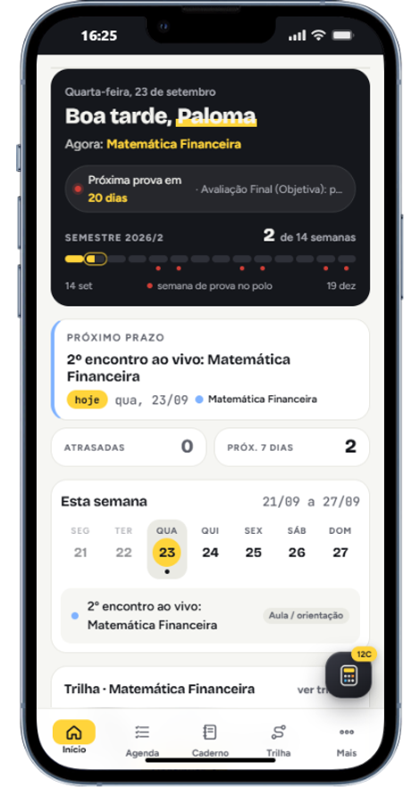
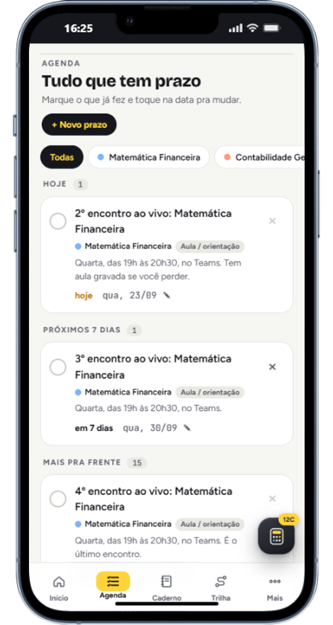
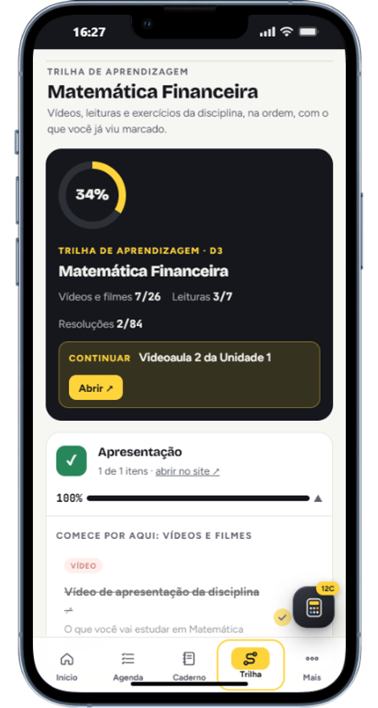
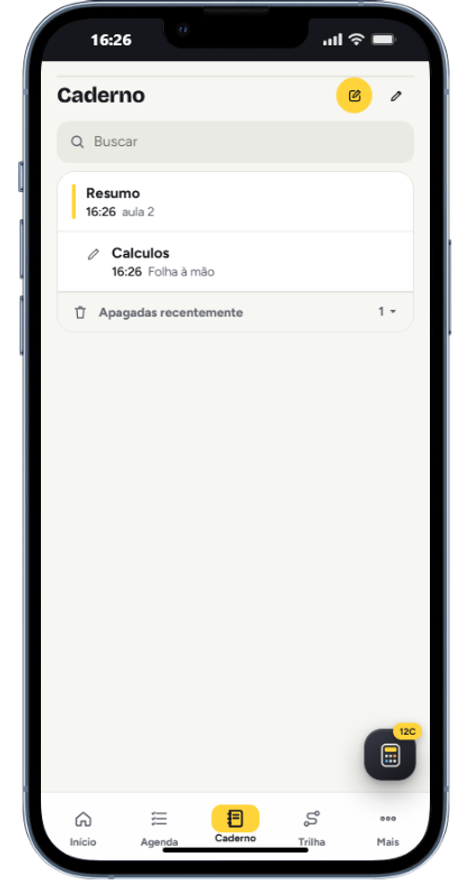
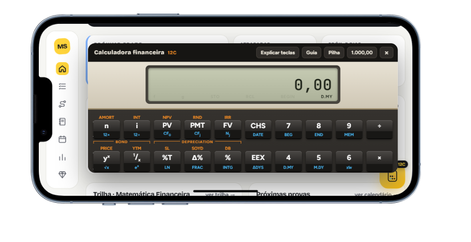
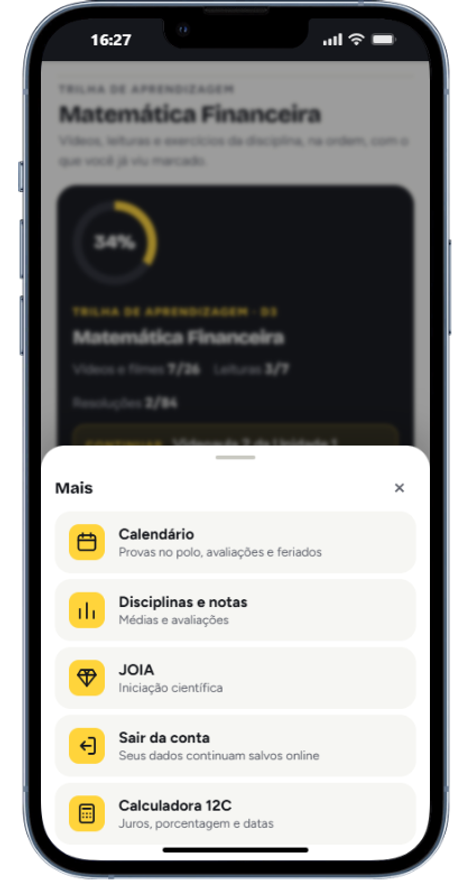

# 📘 Meu Semestre

**Organizador acadêmico para quem estuda a distância** — prazos, notas, trilha de aprendizagem, caderno com escrita à mão e uma calculadora financeira HP-12C. Instala no celular, funciona sem internet e sincroniza sozinho.


🔗 **[Ver o app funcionando](https://college-organizer-app.vercel.app/)**

<table align="center">
  <tr>
    <td align="center" width="25%"></td>
    <td align="center" width="25%"></td>
    <td align="center" width="25%"></td>
    <td align="center" width="25%"></td>
  </tr>
  <tr>
    <td align="center"><sub><b>Início</b><br/>o que vem primeiro</sub></td>
    <td align="center"><sub><b>Agenda</b><br/>prazos por urgência</sub></td>
    <td align="center"><sub><b>Trilha</b><br/>progresso da disciplina</sub></td>
    <td align="center"><sub><b>Caderno</b><br/>texto e folhas à mão</sub></td>
  </tr>
</table>

<p align="center">
  
  <br/>
  <sub><b>Calculadora 12C</b> — abre por cima de qualquer tela, sem perder o que estava sendo feito</sub>
</p>

---

## Por que existe

Curso a distância não tem quadro de avisos nem colega do lado pra lembrar que a prova é sexta. As informações chegam espalhadas: prazo no portal, prova no calendário, matéria na trilha, nota numa planilha.

Este app junta tudo num lugar só — e foi feito para o celular primeiro, porque é onde a consulta acontece: no ônibus, na fila, entre uma aula e outra.

Não é uma demonstração: está em uso diário desde que ficou pronto, e cada funcionalidade nasceu de uma necessidade que apareceu no meio do semestre.

---

## O que ele faz

| Seção | O que resolve |
|---|---|
| **Início** | O próximo prazo, a semana em faixa, provas com contagem regressiva, médias e lembretes |
| **Agenda** | Prazos agrupados por urgência (atrasados, hoje, 7 dias, depois), com desfazer ao apagar |
| **Trilha** | A trilha de Matemática Financeira por unidade, marcando o que já foi estudado |
| **Caderno** | Notas em texto e **folhas à mão** para resolver contas com caneta de toque |
| **Calendário** | Trilha do semestre, provas no polo, RecuperAí e feriados |
| **Disciplinas** | Avaliações com peso, média calculada e quanto falta para passar |
| **Calculadora 12C** | HP-12C com notação RPN: juros compostos, PV/PMT/FV, NPV, TIR e amortização |

---

## Decisões técnicas

### Um arquivo só, sem etapa de build

O app inteiro são **2.800 linhas num único `index.html`** — telas, estilos e lógica. As únicas dependências externas são os três SDKs do Firebase. Não há framework, `package.json`, bundler nem etapa de build.

Isso foi escolha, não limitação. Um projeto pessoal que precisa sobreviver a meses sem manutenção não deveria quebrar porque uma dependência mudou de versão. Aqui, `git push` e o app está no ar: o que está escrito é o que roda, e abrir o arquivo no navegador é o ambiente de desenvolvimento inteiro.

O custo é real — um arquivo desse tamanho é mais difícil de navegar do que módulos separados, e a organização depende de disciplina em vez de estrutura. Para este tamanho, valeu a troca.

### Offline de verdade, não só um aviso bonitinho

Duas camadas trabalham juntas:

- **Service worker** guarda a casca do app em cache, então ele abre sem rede
- **`enablePersistence` do Firestore** guarda os dados no aparelho e enfileira as escritas

Na prática: dá para marcar uma tarefa no metrô sem sinal e ela sobe sozinha quando a conexão voltar.

### Segurança tratada como requisito

Um app que guarda a vida acadêmica de alguém merece mais do que login e esperança:

- **Regras do Firestore** exigem três coisas para qualquer leitura ou escrita: estar autenticado, o `uid` bater com o dono do caminho, e o e-mail ser verificado. Tudo fora de `users/{uid}/` é negado explicitamente.
- **Content-Security-Policy restritiva** no `vercel.json`: `default-src 'self'`, `object-src 'none'`, `frame-ancestors 'none'`. Cada origem externa liberada é nominal — Google e Firebase, nada além.
- **Sanitização na entrada**: texto colado no Caderno passa por um filtro que remove scripts e URLs perigosas antes de virar HTML.
- **Chave da API restrita por domínio** no Google Cloud.

### Emulação da HP-12C

A calculadora implementa **notação polonesa reversa** com pilha de quatro registradores e a tecla `ENTER`, mais os registradores financeiros `PV`, `PMT`, `FV`, `i` e `n` — o mesmo modelo mental da HP-12C que o curso exige.

Além das funções: juros compostos, NPV, TIR e tabela de amortização. Tem ainda um modo **"Explicar teclas"**, porque aprender RPN é metade da dificuldade da prova.

### Escrita à mão com caneta

O Caderno tem folhas em `<canvas>` com **Pointer Events**, distinguindo dedo de caneta e respondendo à pressão. Resolver uma conta escrevendo é mais rápido do que digitar — e é assim que a prova é feita.

### Navegação pensada para o polegar



As quatro seções do dia a dia ficam numa barra fixa na base, dentro do alcance do polegar. O que se usa de vez em quando — calendário, notas, JOIA — mora atrás de **Mais**, que abre como painel deslizante a partir da base em vez de uma página nova: nada se perde de vista e fechar é um gesto.

A calculadora tem botão flutuante próprio, porque ela é chamada **no meio de outra coisa** — lendo um exercício, conferindo uma parcela. Sair da tela para calcular quebraria o raciocínio.

Todas as medidas somam `env(safe-area-inset-*)`, então nada encosta no notch nem na barra de gestos, e o app instalado ocupa a tela inteira sem parecer um site espremido.

<br clear="right" />


---

## Rodando localmente

Não precisa instalar nada:

```bash
git clone https://github.com/palomagl/meu-semestre-app.git
cd meu-semestre-app
```

Abra o `index.html` no navegador. Para o login do Google funcionar, é preciso um projeto no Firebase — veja abaixo.

<details>
<summary><strong>Configurar o Firebase (uma vez só)</strong></summary>

1. Em [console.firebase.google.com](https://console.firebase.google.com), **Criar projeto** → nome `meu-semestre` → pode desligar o Analytics
2. **Authentication → Método de login → Google** → ativar → escolher o e-mail de suporte → **Salvar**
3. **Authentication → Configurações → Domínios autorizados** → adicionar o domínio do site
4. **Firestore Database → Criar banco** → região `southamerica-east1` (São Paulo) → **modo de produção**
5. **Firestore → Regras** → colar o conteúdo de `firestore.rules` → **Publicar**
6. **⚙️ Configurações do projeto → Seus apps → `</>`** → copiar o `firebaseConfig` para o arquivo `firebase-config.js`

Os valores do `firebase-config.js` são públicos por design: identificam o projeto, não autorizam nada. Quem protege os dados são as regras do passo 5.

</details>

---

## Instalar no celular

- **iPhone (Safari)**: abrir o site → **Compartilhar** → **Adicionar à Tela de Início**
- **Android (Chrome)**: abrir o site → **⋮** → **Instalar app**

Abre em tela cheia, com ícone próprio, e funciona sem internet.

---

## Estrutura

```
index.html              o app inteiro — telas, estilos e lógica
firebase-config.js      configuração do projeto Firebase
firestore.rules         regras de segurança do banco
vercel.json             cabeçalhos de segurança (CSP, anti-clickjacking)
manifest.webmanifest    nome, cores e ícones do app instalável
sw.js                   service worker — faz o app abrir sem internet
icons/                  ícones em todos os tamanhos
```

---

## Contato

[](https://www.linkedin.com/in/palomagl)

---

> Feito para resolver um problema real, e usado todo dia desde então.
